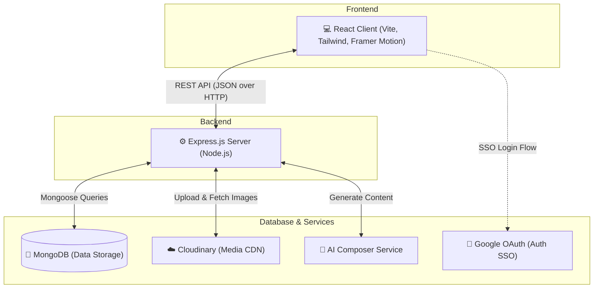

<div align="center">
  

  # 🗓️ Social Scheduler 🗓️
  
  **The ultimate premium platform to automate and manage your social presence.**

  <p align="center">
    [](https://reactjs.org/)
    [](https://www.typescriptlang.org/)
    [](https://tailwindcss.com/)
    [](https://nodejs.org/)
    [](https://www.mongodb.com/)
    [](https://opensource.org/licenses/MIT)
  </p>

</div>

---

## 🌌 Overview

**Social Scheduler** is a state-of-the-art social media management tool designed for creators, agencies, and brands. Built with a sleek, **premium black and white UI with blue shades**, and powerful AI integrations, it allows you to effortlessly plan, create, and schedule your content across multiple platforms from a single, centralized dashboard.

## ⚡ The Problem & Our Solution

### 🌑 The Problems Users Face
- 🚧 **Writer's Block & Content Fatigue:** Coming up with fresh, high-quality captions and hashtags every single day is exhausting.
- 🧩 **Platform Fragmentation:** Logging into Instagram, Twitter, LinkedIn, and Facebook separately just to post the same content wastes hours.
- ⏱️ **Inconsistent Scheduling:** Missing peak engagement times because you forgot to manually hit "Publish."
- 📉 **Poor User Experience:** Many existing legacy tools feel outdated, clunky, or require steep learning curves.

### 🌕 How We Overcome These Problems
We built **Social Scheduler** to solve these pain points by offering an all-in-one, unified command center:
1. 🤖 **AI-Powered Generation:** By integrating an intelligent **AI Composer**, we eliminate writer's block by automatically generating engaging copy and hashtags tailored to specific platforms.
2. 🎛️ **Unified Dashboard:** We brought multiple platforms into one seamless interface, allowing users to schedule and publish everywhere with a single click.
3. 💎 **Premium UI/UX:** We ditched the clunky dashboards of the past, utilizing **Tailwind CSS** and **Framer Motion** to deliver a sleek, glassmorphic, and highly intuitive experience that users actually *enjoy* interacting with.
4. ⚙️ **Reliable Automation:** Our backend ensures posts go out exactly when scheduled, so creators can batch-create content and step away from their screens.

---

## 🏗️ System Architecture

Social Scheduler follows a modern **Client-Server Architecture** utilizing RESTful API principles.



- 🖥️ **Client Layer:** A single-page application (SPA) built with React and Vite. It handles state management locally via Context API and routes dynamically using React Router. UI elements are highly componentized for reusability.
- 🌉 **API Layer:** An Express.js server acting as the bridge. It authenticates requests using JSON Web Tokens (JWT) attached to Authorization headers, processes business logic (billing, scheduling), and handles file uploads via Multer.
- 🗄️ **Data Layer:** MongoDB serves as the primary database, mapped via Mongoose schemas to ensure strict typings. Cloudinary is used as a cloud CDN to securely store and serve user avatars and post media files.
- 🔌 **External Integrations:** Google OAuth 2.0 API for seamless 1-click SSO, and third-party Social APIs (Facebook, Twitter, LinkedIn) for post distribution.

---

## 🔵 Languages & Core Technologies

This repository is predominantly built with **TypeScript**, ensuring a highly robust, strictly typed, and scalable codebase across both the frontend and backend. 

- **🟦 TypeScript (97.5%)**: The absolute backbone of Social Scheduler. We utilize TypeScript's powerful static typing to catch errors at compile-time, structure our React components with strict interfaces, and define our Mongoose database schemas securely. This guarantees enterprise-grade stability and an unparalleled developer experience.
- **⬛ CSS (1.5%)**: Minimal raw CSS is used (`index.css`), as we rely heavily on the utility-first power of **Tailwind CSS** to craft our **premium black-and-white aesthetic with striking blue accents**.
- **⬜ Other (1.0%)**: Includes configuration files, JSON, and build scripts that orchestrate our seamless development workflow.

### 💻 Frontend (Client)
| Technology | Description |
|------------|-------------|
| ⚛️ **React 18 (Vite)** | Core UI library, providing a blazing fast developer experience |
| 🛡️ **TypeScript** | Strongly typed, scalable architecture |
| 🎨 **Tailwind CSS** | Utility-first styling for our premium design system |
| 🪄 **Framer Motion** | For complex, buttery-smooth page transitions |
| 🧭 **React Router v6** | Declarative, dynamic client-side routing |

### ⚙️ Backend (Server)
| Technology | Description |
|------------|-------------|
| 🟢 **Node.js** | Fast, asynchronous JavaScript runtime |
| 🚂 **Express.js** | Minimalist web framework for building robust APIs |
| 🍃 **MongoDB (Mongoose)** | Flexible NoSQL document database for our data layer |
| 🔐 **Google OAuth 2.0 & JWT** | Highly secure authentication and Single Sign-On |
| ☁️ **Cloudinary** | Fast, reliable cloud storage for user avatars and media |

---

## 📂 Folder Structure

```text
Social-Scheduler/
├── client/                     # React Frontend
│   ├── src/
│   │   ├── api/                # Axios interceptors & HTTP config
│   │   ├── components/         # Reusable UI components (Sidebar, Modals)
│   │   ├── context/            # Global React Context (AuthContext)
│   │   ├── pages/              # Full page views (Dashboard, Support, etc.)
│   │   ├── App.tsx             # Main router & layout configuration
│   │   └── index.css           # Global styles & Tailwind directives
│   ├── tailwind.config.js      # Tailwind theme extensions & custom colors
│   └── package.json            # Frontend dependencies
│
└── server/                     # Node.js Backend
    ├── config/                 # Database, Multer, & Cloudinary configs
    ├── controllers/            # Route controllers containing business logic
    ├── middlewares/            # Auth guards & global error handlers
    ├── models/                 # Mongoose database schemas
    ├── routes/                 # API route definitions
    ├── utils/                  # Helper functions (Token generation, etc.)
    ├── server.ts               # Main Express entry point
    └── package.json            # Backend dependencies
```

---

## 📡 API Reference

Here is a high-level overview of our core RESTful API endpoints:

**🔑 Authentication Routes (`/api/auth`)**
- 📝 `POST /register` - Create a new user account
- 🔓 `POST /login` - Authenticate a user and return a JWT
- 🌐 `POST /google` - Handle Google OAuth SSO
- 👤 `GET /me` - Retrieve current authenticated user data
- 🖼️ `PUT /profile` - Update user details and avatar (Multipart Form)

**🛠️ Core Feature Routes**
- 📅 `GET/POST /api/posts` - Fetch user's scheduled posts or create a new post
- 🔗 `GET/POST /api/accounts` - Manage connected social media accounts
- 📊 `GET /api/activity` - Fetch the user's recent activity log
- 🎟️ `GET/POST /api/support` - Create or fetch premium support tickets
- 💳 `GET/POST /api/billing` - Handle subscription upgrades and payments

---

## 💻 Detailed Installation & Setup

Follow these steps to set up the project locally on your machine from scratch.

### 📋 Prerequisites
- 📦 [Node.js](https://nodejs.org/) (v18 or higher)
- 🍃 [MongoDB](https://www.mongodb.com/) (Local instance or MongoDB Atlas cluster)
- 🐙 [Git](https://git-scm.com/)

### 1️⃣ Clone the repository

```bash
git clone https://github.com/Aadityaanand2002/Social-Scheduler.git
cd Social-Scheduler
```

### 2️⃣ Initialize and Install Backend

Navigate to the `server` directory and install the necessary Node.js packages:

```bash
cd server

# Install core dependencies used in this project
npm install express mongoose dotenv cors bcryptjs jsonwebtoken multer cloudinary

# Install TypeScript and developer dependencies
npm install -D typescript ts-node nodemon @types/express @types/mongoose
```

### 3️⃣ Initialize and Install Frontend

Open a new terminal, navigate to the `client` directory, and install the React packages:

```bash
cd client

# If initializing from scratch:
# npx create-vite@latest . --template react-ts

# Install core UI dependencies
npm install react-router-dom axios framer-motion lucide-react react-hot-toast react-hook-form

# Install styling dependencies
npm install -D tailwindcss postcss autoprefixer
```

### 4️⃣ Configure Environment Variables

You must create a `.env` file in both the `client` and `server` directories to configure your local environment.

**`server/.env`**
```env
PORT=5000
MONGO_URI=your_mongodb_connection_string
JWT_SECRET=your_super_secret_jwt_key
GOOGLE_CLIENT_ID=your_google_client_id
GOOGLE_CLIENT_SECRET=your_google_client_secret
CLOUDINARY_CLOUD_NAME=your_cloudinary_name
CLOUDINARY_API_KEY=your_cloudinary_api_key
CLOUDINARY_API_SECRET=your_cloudinary_api_secret
```

**`client/.env`**
```env
VITE_API_URL=http://localhost:5000
VITE_GOOGLE_CLIENT_ID=your_google_client_id
```

### 5️⃣ Run the Application

Run both the server and client concurrently in separate terminal windows:

**Terminal 1 (Backend):**
```bash
cd server
npm run server
```

**Terminal 2 (Frontend):**
```bash
cd client
npm run dev
```

🌐 Open [http://localhost:5173](http://localhost:5173) in your browser to view the application!

---

## 🔮 Future Roadmap

- ⬜ **Advanced AI Analytics:** Use AI to predict the best time to post based on historical engagement data.
- ⬜ **Multi-Workspace Support:** Allow agency users to switch between different client workspaces.
- ⬜ **Mobile Application:** A React Native companion app for scheduling on-the-go.
- ⬜ **Automated Reports:** Weekly PDF summaries of social growth sent directly to users' emails.

---

## 🤝 Contributing

Contributions, issues, and feature requests are welcome! 
Feel free to check the [issues page](https://github.com/Aadityaanand2002/Social-Scheduler/issues) if you want to contribute.

## 📄 License

This project is licensed under the MIT License - see the [LICENSE](LICENSE) file for details.

---
<div align="center">
  <i>Designed by <b>Aditya Anand</b></i>
</div>
