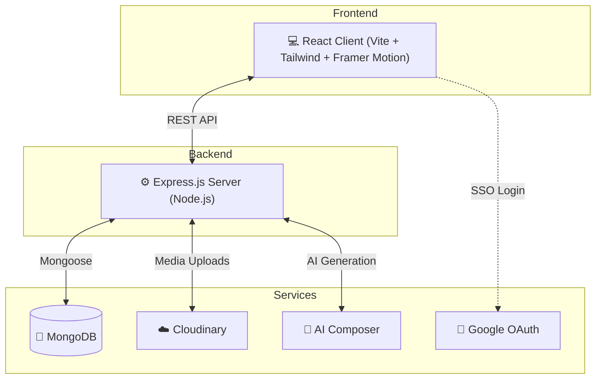

<div align="center">
  

  # 🗓️ Social Scheduler
  ### **Premium social media automation platform**

  <p>
    
    
    
  </p>

  <p>
    <a href="https://reactjs.org/"></a>
    <a href="https://www.typescriptlang.org/"></a>
    <a href="https://tailwindcss.com/"></a>
    <a href="https://nodejs.org/"></a>
    <a href="https://www.mongodb.com/"></a>
    <a href="https://opensource.org/licenses/MIT"></a>
  </p>

  <p>
    <a href="https://github.com/Aadityaanand2002/Social-Scheduler/stargazers"></a>
    <a href="https://github.com/Aadityaanand2002/Social-Scheduler/network/members"></a>
    <a href="https://github.com/Aadityaanand2002/Social-Scheduler/issues"></a>
    <a href="https://github.com/Aadityaanand2002/Social-Scheduler/blob/main/LICENSE"></a>
  </p>
</div>

***

## ✨ Overview

**Social Scheduler** is a modern social media management platform built for creators, agencies, and brands that want speed, consistency, and a premium workspace.
It combines post planning, AI-assisted content generation, scheduling, account management, and media handling inside one centralized dashboard.

### 🎯 Core Value
- 🤖 AI-generated captions, content ideas, and hashtags.
- 📅 Unified scheduling across multiple social platforms.
- 🎨 Premium black, white, and blue design language.
- ⚡ Fast full-stack architecture powered by TypeScript.
- 🔐 Secure authentication with Google OAuth and JWT.

***

## 🧩 Problem & Solution

### Problems this solves
- 🚧 Content creation becomes repetitive and mentally draining.
- 🧱 Managing multiple social platforms separately wastes time.
- ⏰ Manual posting leads to missed schedules and poor consistency.
- 📉 Traditional dashboards often feel outdated and cluttered.

### Social Scheduler approach
- 🤖 **AI Composer** helps generate engaging captions and hashtag sets.
- 🗂️ **Unified dashboard** manages posts, accounts, activity, billing, and support from one place.
- 💎 **Premium UI/UX** uses sleek layouts, glass-like surfaces, and motion-rich interactions.
- 🔁 **Automation-first workflow** lets users batch-create and schedule content with confidence.

***

## 🏗️ Architecture



### Architecture highlights
- **Frontend:** React + Vite single-page application with reusable components and route-based views.
- **Backend:** Express server handling authentication, business logic, scheduling, uploads, and integrations.
- **Database:** MongoDB with Mongoose schemas for structured, scalable document modeling.
- **Integrations:** Google OAuth, Cloudinary, and third-party social APIs for publishing workflows.

***

## 🛠️ Tech Stack

### Frontend
| Tech | Role |
|------|------|
| ⚛️ React 18 | Core UI library |
| 🟦 TypeScript | Type-safe frontend architecture |
| 🎨 Tailwind CSS | Utility-first premium styling |
| 🪄 Framer Motion | Smooth animations and transitions |
| 🧭 React Router v6 | Client-side navigation |
| 🔥 React Hot Toast | Elegant notification system |
| 🧾 React Hook Form | Form handling and validation |

### Backend
| Tech | Role |
|------|------|
| 🟢 Node.js | JavaScript runtime |
| 🚂 Express.js | REST API framework |
| 🍃 MongoDB | Primary database |
| 🧬 Mongoose | Schema modeling |
| 🔐 JWT | Auth token handling |
| 🌐 Google OAuth 2.0 | Single sign-on authentication |
| ☁️ Cloudinary | Media storage and delivery |
| 📦 Multer | File upload middleware |

### Design language
- ⚫ **Black** for strong premium contrast.
- ⚪ **White** for clarity and clean spacing.
- 🔵 **Blue shades** for modern highlights and visual identity.

***

## 📁 Folder Structure

```text
Social-Scheduler/
├── client/
│   ├── src/
│   │   ├── api/
│   │   ├── components/
│   │   ├── context/
│   │   ├── pages/
│   │   ├── App.tsx
│   │   └── index.css
│   ├── tailwind.config.js
│   └── package.json
│
└── server/
    ├── config/
    ├── controllers/
    ├── middlewares/
    ├── models/
    ├── routes/
    ├── utils/
    ├── server.ts
    └── package.json
```

***

## 🚀 Features

- 📅 Schedule and manage social posts from one dashboard.
- 🤖 Generate captions and hashtags with AI assistance.
- 🔗 Connect and manage multiple social accounts.
- 🖼️ Upload media securely with Cloudinary integration.
- 📊 Track recent activity in a clean dashboard view.
- 💳 Support premium billing and subscription workflows.
- 🎟️ Built-in support ticket handling.
- 🔐 Secure login with Google OAuth and JWT authentication.

***

## 📡 API Snapshot

### Authentication
- `POST /api/auth/register` — Create a new account.
- `POST /api/auth/login` — Authenticate user and return JWT.
- `POST /api/auth/google` — Sign in with Google OAuth.
- `GET /api/auth/me` — Fetch authenticated user profile.
- `PUT /api/auth/profile` — Update user profile and avatar.

### Main modules
- `GET/POST /api/posts` — Create and fetch scheduled posts.
- `GET/POST /api/accounts` — Manage connected social accounts.
- `GET /api/activity` — Retrieve recent activity logs.
- `GET/POST /api/support` — Create and track support tickets.
- `GET/POST /api/billing` — Manage plans and payments.

***

## ⚙️ Installation

### Prerequisites
- Node.js v18+
- MongoDB local instance or Atlas cluster
- Git

### Clone repository
```bash
git clone https://github.com/Aadityaanand2002/Social-Scheduler.git
cd Social-Scheduler
```

### Backend setup
```bash
cd server
npm install express mongoose dotenv cors bcryptjs jsonwebtoken multer cloudinary
npm install -D typescript ts-node nodemon @types/express @types/mongoose
```

### Frontend setup
```bash
cd client
npm install react-router-dom axios framer-motion lucide-react react-hot-toast react-hook-form
npm install -D tailwindcss postcss autoprefixer
```

### Environment variables
**server/.env**
```env
PORT=5000
MONGO_URI=your_mongodb_connection_string
JWT_SECRET=your_super_secret_jwt_key
GOOGLE_CLIENT_ID=your_google_client_id
GOOGLE_CLIENT_SECRET=your_google_client_secret
CLOUDINARY_CLOUD_NAME=your_cloudinary_name
CLOUDINARY_API_KEY=your_cloudinary_api_key
CLOUDINARY_API_SECRET=your_cloudinary_api_secret
```

**client/.env**
```env
VITE_API_URL=http://localhost:5000
VITE_GOOGLE_CLIENT_ID=your_google_client_id
```

### Run the app
```bash
# terminal 1
cd server
npm run server

# terminal 2
cd client
npm run dev
```

Open `http://localhost:5173` in your browser.

***

## 🔮 Roadmap

- 📈 Advanced AI analytics for post timing prediction.
- 🏢 Multi-workspace support for agencies.
- 📱 Mobile companion app with React Native.
- 🧾 Automated weekly PDF growth reports.

***

## 🤝 Contributing

Contributions, issues, and feature requests are welcome.
Please open an issue or submit a pull request to improve the platform.

***

## 📄 License

Distributed under the MIT License.
See the [LICENSE](LICENSE) file for more information.

***

<div align="center">
  <sub>Designed with ⚫⚪🔵 by <b>Aditya Anand</b></sub>
</div>
