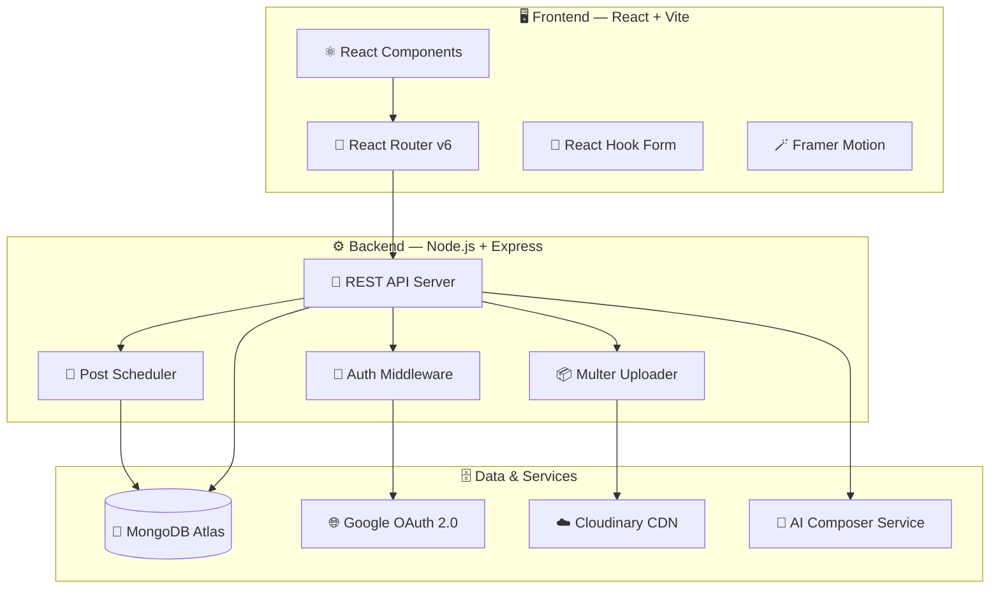

<div align="center">

<br/>

```
███████╗ ██████╗  ██████╗██╗ █████╗ ██╗      ███████╗ ██████╗██╗  ██╗███████╗██████╗ ██╗   ██╗██╗     ███████╗██████╗
██╔════╝██╔═══██╗██╔════╝██║██╔══██╗██║      ██╔════╝██╔════╝██║  ██║██╔════╝██╔══██╗██║   ██║██║     ██╔════╝██╔══██╗
███████╗██║   ██║██║     ██║███████║██║      ███████╗██║     ███████║█████╗  ██║  ██║██║   ██║██║     █████╗  ██████╔╝
╚════██║██║   ██║██║     ██║██╔══██║██║      ╚════██║██║     ██╔══██║██╔══╝  ██║  ██║██║   ██║██║     ██╔══╝  ██╔══██╗
███████║╚██████╔╝╚██████╗██║██║  ██║███████╗ ███████║╚██████╗██║  ██║███████╗██████╔╝╚██████╔╝███████╗███████╗██║  ██║
╚══════╝ ╚═════╝  ╚═════╝╚═╝╚═╝  ╚═╝╚══════╝ ╚══════╝ ╚═════╝╚═╝  ╚═╝╚══════╝╚═════╝  ╚═════╝ ╚══════╝╚══════╝╚═╝  ╚═╝
```

### ⚡ Premium Social Media Automation Platform

<br/>

[](https://reactjs.org/)
[](https://www.typescriptlang.org/)
[](https://tailwindcss.com/)
[](https://nodejs.org/)
[](https://www.mongodb.com/)

[](https://github.com/Aadityaanand2002/Social-Scheduler/stargazers)
[](https://github.com/Aadityaanand2002/Social-Scheduler/network/members)
[](https://github.com/Aadityaanand2002/Social-Scheduler/issues)
[](https://github.com/Aadityaanand2002/Social-Scheduler/blob/main/LICENSE)

<br/>

> **Create smarter. Schedule faster. Grow consistently.**
> AI-powered content scheduling for creators, agencies, and brands — all from one premium dashboard.

<br/>

[🚀 Get Started](#%EF%B8%8F-installation) · [✨ Features](#-features) · [🏗️ Architecture](#%EF%B8%8F-architecture) · [📡 API Docs](#-api-snapshot) · [🔮 Roadmap](#-roadmap) · [🤝 Contribute](#-contributing)

<br/>

---

</div>

<br/>

## 🌟 What is Social Scheduler?

**Social Scheduler** is a modern, full-stack social media management platform built for creators, agencies, and brands that demand speed, consistency, and a premium workspace.

It brings post planning, AI-assisted content generation, scheduling, account management, and media handling into **one centralized dashboard** — eliminating tool-switching and missed posts forever.

<br/>

<table>
<tr>
<td width="50%">

### 🔥 Why Social Scheduler?

| Problem | Solution |
|---|---|
| 🧠 Content fatigue | 🤖 AI Composer for captions & hashtags |
| 🕐 Manual posting | 📅 Automated multi-platform scheduling |
| 🗂️ Platform juggling | 🖥️ Unified account dashboard |
| 📉 Cluttered dashboards | 💎 Premium, distraction-free UI |

</td>
<td width="50%">

### ⚡ At a Glance

```
🤖  AI caption & hashtag generation
📅  Multi-platform post scheduling
🔗  Manage multiple social accounts
🖼️  Cloudinary media uploads
📊  Activity tracking dashboard
💳  Billing & subscription support
🎟️  Built-in support ticket system
🔐  Google OAuth + JWT security
```

</td>
</tr>
</table>

<br/>

---

## ✨ Features

<br/>

<details>
<summary><b>🤖 AI Content Composer</b></summary>
<br/>

Generate platform-ready captions, hashtag sets, and content ideas in seconds. The AI Composer understands tone, context, and your brand voice — eliminating creative blocks instantly.

- Auto-generate captions from a topic or image
- Smart hashtag recommendations with reach estimates
- Multiple tone variations: formal, casual, promotional, storytelling
- Supports all major platform formats

</details>

<details>
<summary><b>📅 Unified Scheduling Dashboard</b></summary>
<br/>

Plan, preview, and schedule posts across all your connected accounts from a single view. No tab switching. No missed windows.

- Drag-and-drop calendar interface
- Batch scheduling for bulk content creation
- Best time recommendations per platform
- Post preview per platform's format

</details>

<details>
<summary><b>🔗 Multi-Account Management</b></summary>
<br/>

Connect and manage multiple social media profiles — for yourself, your clients, or your brand — without ever logging out.

- Connect unlimited social profiles
- Per-account analytics and activity logs
- Role-based access for teams

</details>

<details>
<summary><b>🖼️ Cloudinary Media Hub</b></summary>
<br/>

Upload images and videos once, reuse everywhere. Cloudinary integration ensures fast delivery and secure storage.

- Drag-and-drop media upload
- Automatic image optimization
- Searchable media library

</details>

<details>
<summary><b>🔐 Secure Authentication</b></summary>
<br/>

Enterprise-grade security with Google OAuth 2.0 and JWT token management.

- One-click Google Sign-In
- JWT refresh token rotation
- Encrypted session management

</details>

<br/>

---

## 🏗️ Architecture



<br/>

### 🔑 Architecture Highlights

| Layer | Technology | Purpose |
|---|---|---|
| 🖥️ **Frontend** | React 18 + Vite + TypeScript | Fast SPA with type-safe components |
| 🎨 **Styling** | Tailwind CSS + Framer Motion | Utility-first UI with rich animations |
| ⚙️ **Backend** | Node.js + Express.js | RESTful API server with middleware stack |
| 🗄️ **Database** | MongoDB + Mongoose | Flexible document storage with schemas |
| 🔐 **Auth** | Google OAuth 2.0 + JWT | Secure SSO and stateless token auth |
| ☁️ **Media** | Cloudinary | Optimized cloud media storage & delivery |
| 🤖 **AI** | AI Composer Service | Caption, hashtag, and content generation |

<br/>

---

## 🛠️ Tech Stack

<br/>

<table>
<tr><th>Frontend</th><th>Backend</th><th>Design</th></tr>
<tr>
<td>

| Tech | Version | Role |
|---|---|---|
| ⚛️ React | 18 | Core UI library |
| 🟦 TypeScript | 5+ | Type-safe codebase |
| 🎨 Tailwind CSS | 3 | Utility-first styling |
| 🪄 Framer Motion | latest | Animations & transitions |
| 🧭 React Router | v6 | Client-side routing |
| 🔥 React Hot Toast | latest | Notification system |
| 🧾 React Hook Form | latest | Form handling |

</td>
<td>

| Tech | Version | Role |
|---|---|---|
| 🟢 Node.js | 18+ | JavaScript runtime |
| 🚂 Express.js | 4 | REST API framework |
| 🍃 MongoDB | 6+ | Primary database |
| 🧬 Mongoose | 7+ | Schema modeling |
| 🔐 JWT | latest | Auth token handling |
| 🌐 Google OAuth 2.0 | - | Single sign-on |
| ☁️ Cloudinary | latest | Media storage |
| 📦 Multer | latest | File upload middleware |

</td>
<td>

| Property | Value |
|---|---|
| ⚫ Primary | `#000000` |
| ⚪ Secondary | `#FFFFFF` |
| 🔵 Accent | `#007ACC` |
| 🎯 Style | Glass surfaces |
| ✨ Motion | Framer-rich |
| 📐 Layout | Component-first |

</td>
</tr>
</table>

<br/>

---

## 📁 Project Structure

```
Social-Scheduler/
│
├── 🖥️ client/                    # React Frontend (Vite + TypeScript)
│   ├── src/
│   │   ├── 🔌 api/               # Axios API client and service functions
│   │   ├── 🧩 components/        # Reusable UI components
│   │   ├── 🧠 context/           # Global state (Auth, Theme, etc.)
│   │   ├── 📄 pages/             # Route-level page components
│   │   ├── App.tsx               # Root application component
│   │   └── index.css             # Global styles + Tailwind imports
│   ├── tailwind.config.js        # Tailwind customization
│   └── package.json
│
└── ⚙️ server/                    # Express Backend (Node.js + TypeScript)
    ├── 🔧 config/                # DB connection, OAuth, Cloudinary setup
    ├── 🎮 controllers/           # Route handler logic
    ├── 🛡️ middlewares/           # Auth guards, error handlers
    ├── 🗄️ models/                # Mongoose schemas
    ├── 🛤️ routes/                # Express route definitions
    ├── 🔨 utils/                 # Helper functions
    ├── server.ts                 # Entry point
    └── package.json
```

<br/>

---

## 📡 API Snapshot

<br/>

<details>
<summary><b>🔐 Authentication Endpoints</b></summary>
<br/>

| Method | Endpoint | Description |
|---|---|---|
| `POST` | `/api/auth/register` | Create a new user account |
| `POST` | `/api/auth/login` | Authenticate and receive JWT |
| `POST` | `/api/auth/google` | Sign in with Google OAuth |
| `GET` | `/api/auth/me` | Fetch authenticated user profile |
| `PUT` | `/api/auth/profile` | Update profile details and avatar |

</details>

<details>
<summary><b>📅 Posts & Scheduling</b></summary>
<br/>

| Method | Endpoint | Description |
|---|---|---|
| `GET` | `/api/posts` | Fetch all scheduled posts |
| `POST` | `/api/posts` | Create and schedule a new post |

</details>

<details>
<summary><b>🔗 Accounts, Activity & Billing</b></summary>
<br/>

| Method | Endpoint | Description |
|---|---|---|
| `GET/POST` | `/api/accounts` | Manage connected social accounts |
| `GET` | `/api/activity` | Retrieve recent activity logs |
| `GET/POST` | `/api/billing` | Manage plans and payments |
| `GET/POST` | `/api/support` | Create and track support tickets |

</details>

<br/>

---

## ⚙️ Installation

<br/>

### Prerequisites

```
✅ Node.js v18 or higher
✅ MongoDB (local instance or Atlas cluster)
✅ Git
✅ Cloudinary account (free tier works)
✅ Google Cloud OAuth credentials
```

<br/>

### 1️⃣ Clone the Repository

```bash
git clone https://github.com/Aadityaanand2002/Social-Scheduler.git
cd Social-Scheduler
```

### 2️⃣ Backend Setup

```bash
cd server

# Install production dependencies
npm install express mongoose dotenv cors bcryptjs jsonwebtoken multer cloudinary

# Install dev dependencies
npm install -D typescript ts-node nodemon @types/express @types/mongoose
```

### 3️⃣ Frontend Setup

```bash
cd client

# Install frontend dependencies
npm install react-router-dom axios framer-motion lucide-react react-hot-toast react-hook-form

# Install dev dependencies
npm install -D tailwindcss postcss autoprefixer
```

### 4️⃣ Environment Configuration

**`server/.env`**
```env
PORT=5000
MONGO_URI=your_mongodb_connection_string
JWT_SECRET=your_super_secret_jwt_key
GOOGLE_CLIENT_ID=your_google_client_id
GOOGLE_CLIENT_SECRET=your_google_client_secret
CLOUDINARY_CLOUD_NAME=your_cloudinary_name
CLOUDINARY_API_KEY=your_cloudinary_api_key
CLOUDINARY_API_SECRET=your_cloudinary_api_secret
```

**`client/.env`**
```env
VITE_API_URL=http://localhost:5000
VITE_GOOGLE_CLIENT_ID=your_google_client_id
```

### 5️⃣ Run the App

```bash
# Terminal 1 — Start the backend
cd server
npm run server

# Terminal 2 — Start the frontend
cd client
npm run dev
```

> 🌐 Open **http://localhost:5173** in your browser to access Social Scheduler.

<br/>

---

## 🔮 Roadmap

```
✅  Core scheduling & AI caption generation
✅  Multi-account management
✅  Google OAuth + JWT authentication
✅  Cloudinary media integration
✅  Premium dashboard UI

🔄  Advanced AI analytics for optimal post timing
🔄  Multi-workspace support for agencies
🔄  Mobile companion app (React Native)
🔄  Automated weekly PDF growth reports
```

<br/>

---

## 🤝 Contributing

Contributions are warmly welcome! Here's how to get started:

```bash
# 1. Fork the repository
# 2. Create your feature branch
git checkout -b feature/your-amazing-feature

# 3. Commit your changes
git commit -m "✨ Add: your amazing feature"

# 4. Push to your branch
git push origin feature/your-amazing-feature

# 5. Open a Pull Request
```

Please make sure to:
- 📋 Check existing issues before opening a new one
- 🧪 Write clean, well-commented code
- 📝 Follow the existing project structure
- 🎨 Maintain the black, white & blue design language

<br/>

---

## 📄 License

Distributed under the **MIT License** — free for personal and commercial use.

See the [`LICENSE`](LICENSE) file for full details.

<br/>

---

<div align="center">

### Built with ⚫ ⚪ 🔵

**Social Scheduler** — *Schedule smarter. Grow faster.*

Designed & developed with ❤️ by [**Aditya Anand**](https://github.com/Aadityaanand2002)

<br/>

[](https://github.com/Aadityaanand2002)

<br/>

*If this project helped you, consider giving it a ⭐ — it means a lot!*

</div>
